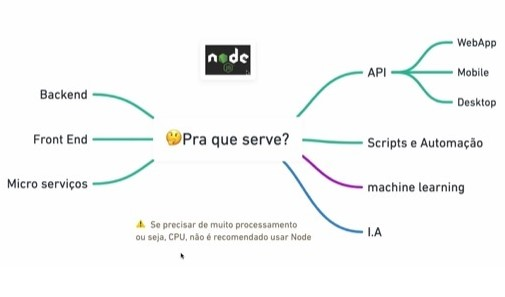
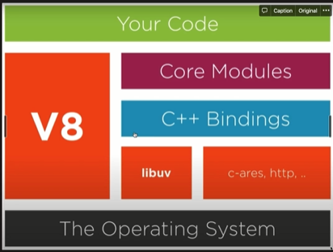
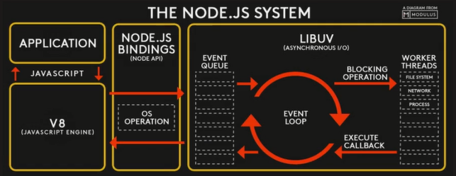

# Node.js

# O que é Node.JS?

- JS `Runtime Environment`
- **Não é um framework ou uma linguagem!!**

# V8 

- *Compõe o ambiente, a máquina virtual, que irá rodar o JS na máquina.*

- *Interpretador de JS para linguagem de maquina.*
- Criado em C++.
- Baseado nas últimas features do JS.
- focado para Chrome, mas tem todo o cuidado de não quebrar o Node.
- Não possui a DOM, console ou File System.

# Como funciona?

- Node é single-threaded, non-blocking e asynchronous

# REPL

- Read-Eval-Print-Loop
- Escrever Javascript em um ambiente node, direto no terminal
- Para entrar, digite `node` no terminal.
- Para sair, digite `.` no terminal.